# About GHC 


## 1. 运行方法

直接下载后，导入Android Studio 即可；

各种库的配置见gradle，作者使用的是当前最新版本AS；

受限于条件，app只在模拟器上测试过，使用的是Pixel 4 的 api 29 版本；


## 2. 已知问题

1、通过OAuth 登录后，第一次回到MineFragment时，顶部的提示语和登录按钮没有自动消失，应该是LiveData的观察还有些小问题，其他场景正常；

2、提交Issue是通过Repo详情页面右下角的加号悬浮按钮完成的，本来想做一下“只有当前用户是owner的repo才显示悬浮按钮”，但没有来得及完成；

3、没有做单元测试；一来是时间有些紧张，二来是因为作者确实对androidx.test.espresso 不怎么用，后续再学习一下吧；


## 3. 核心功能模块
1. 热门仓库浏览（Repo模块）

2. 用户认证与私有仓库管理（Mine模块）

   

## 4. MVVM架构实现（以Repo展示为例）

### 模块依赖关系

```plaintext
App → ViewModel → Repository → Retrofit
           ↑              ↓
        LiveData      SessionManager
```


### MVVM协作流程

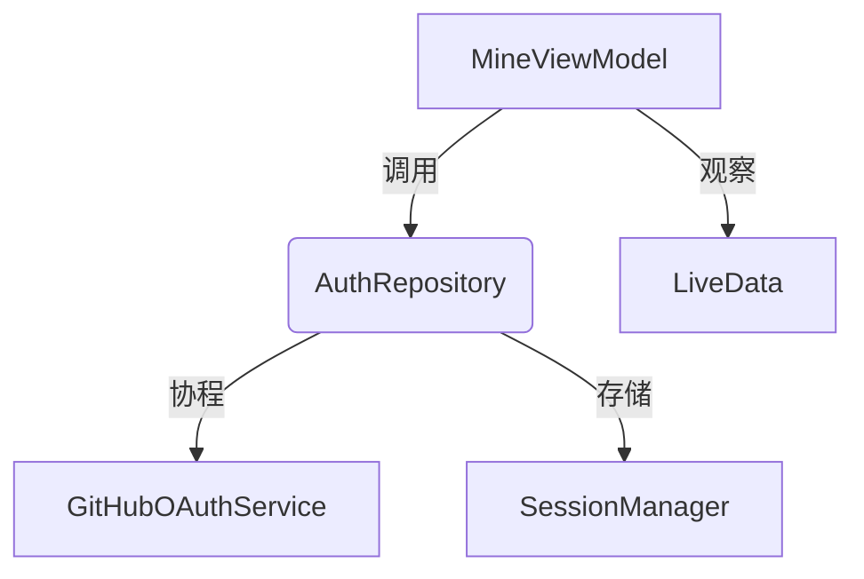


### 4.1 Model 层设计

#### 数据模型映射

Repo数据类完整映射GitHub API响应：

```kotlin
data class Repo(
    val id: Long,                // 仓库唯一标识
    val name: String,            // 仓库名称
    val owner: Owner,            // 所有者信息（嵌套类）
    val description: String?,    // 可空描述
    val language: String?,       // 主要编程语言
    val stargazers_count: Int,   // star数量
    val license: License?,       // 许可证信息（嵌套类） 
    val visibility: String       // 可见性级别
)
```


### 4.2 View层（Activity/Fragment）
- 使用RepoAdapter进行列表数据绑定
- 通过DataBinding实现布局与数据的双向绑定


### 4.3 ViewModel层

```kotlin
// RepoViewModel.kt
@HiltViewModel
class RepoViewModel @Inject constructor(
    private val repository: RepoRepository
) : ViewModel() {
    private val _repos = MutableLiveData<List<Repo>>()
    val repos: LiveData<List<Repo>> = _repos
}
```


### 4.4 Repository层实现

#### 核心职责

1. 数据抽象：封装GitHub API数据源细节
2. 协程管理：提供挂起函数进行异步操作
3. 认证管理：处理OAuth令牌的注入与刷新
4. 错误处理：统一转换网络异常为领域错误


#### Retrofit接口调用

```kotlin
class RepoRepository @Inject constructor(private val apiService: GitHubApiService) {
    suspend fun getPopularRepos(): List<Repo> {
        return runCatching {
            apiService.searchRepositories(query = "stars:>1000", page = page).body()?.items 
        }.getOrDefault(emptyList())
    }
}
```


## 5. OAuth认证流程

1. 授权码获取（前端WebView）
2. Token交换（MineViewModel处理）


### 5.1 完整图解

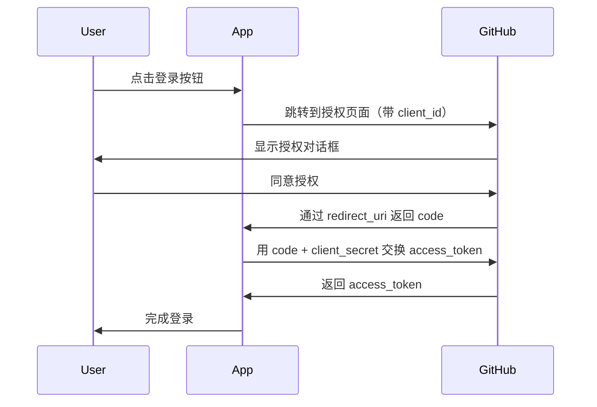


### 5.2 OAuth令牌交换流程

```kotlin
suspend fun exchangeOAuthToken(code: String): AccessTokenResponse = withContext(Dispatchers.IO) {
    val response = authService.getAccessToken(
        clientId = "Ov23lid7vXOMHRrTYQBC",
        clientSecret = "3d5da1c63e30e552c80286e0ceb705dcf2ab2ebe", 
        code = code
    )
    if (!response.isSuccessful) {
        throw Exception("OAuth token exchange failed: ${response.errorBody()?.string()}")
    }
    response.body()!!.also {
        sessionManager.saveAccessToken(it.access_token)
    }
}
```


1. 通过GitHubOAuthService发起令牌请求

2. 使用withContext切换至IO线程执行网络请求

3. 携带硬编码的客户端凭证和授权码进行交换

4. 响应成功后通过SessionManager持久化访问令牌


## 运行截图

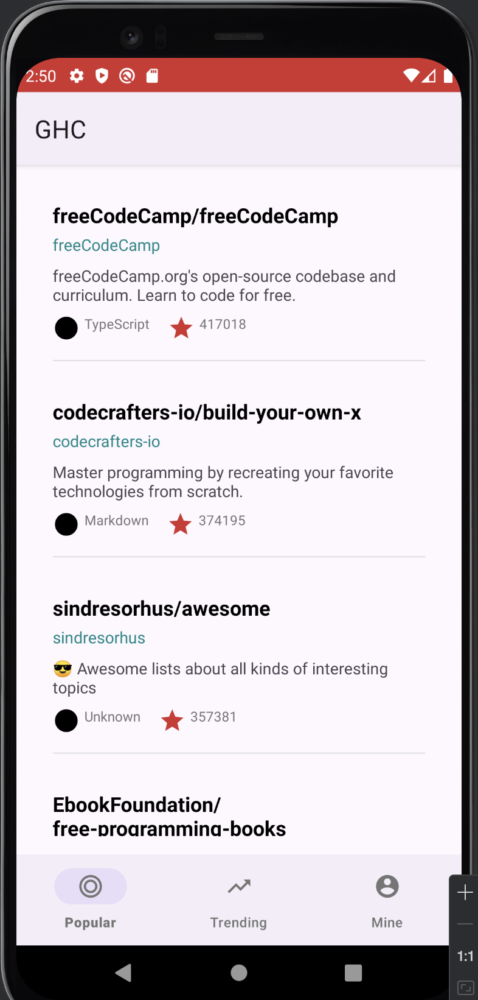

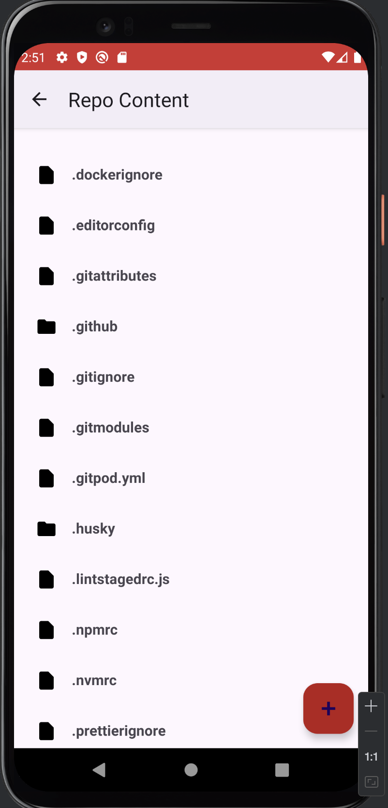

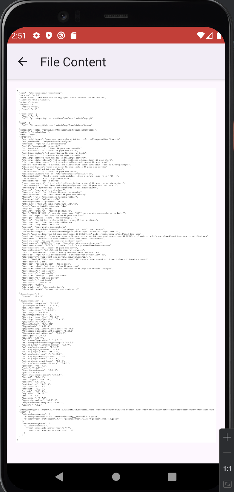

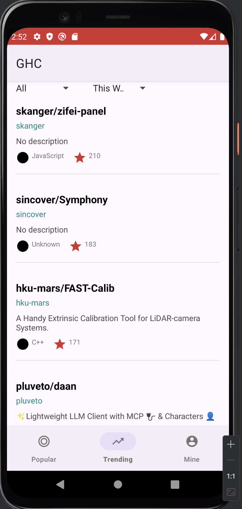

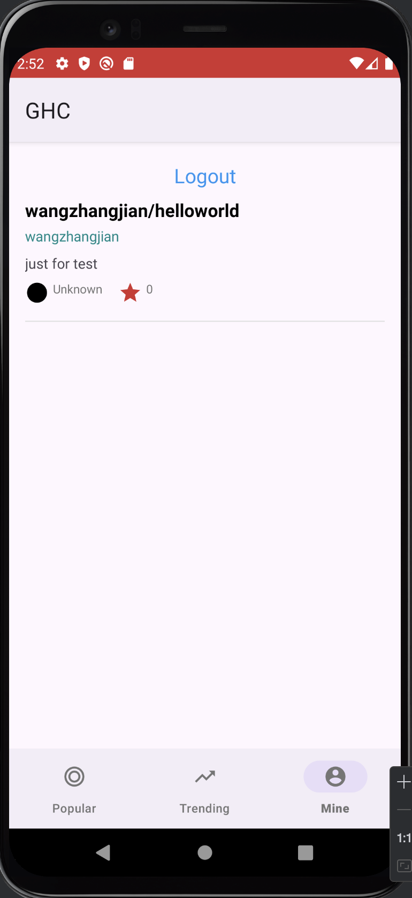

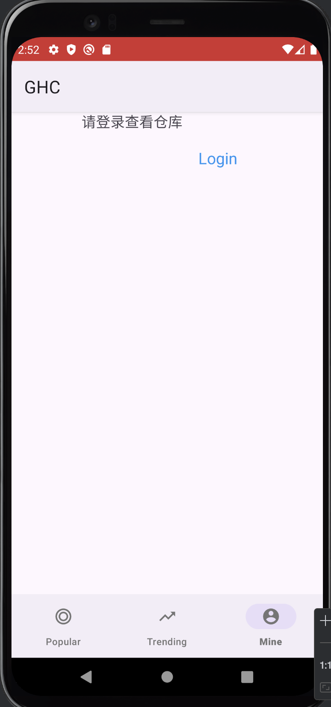

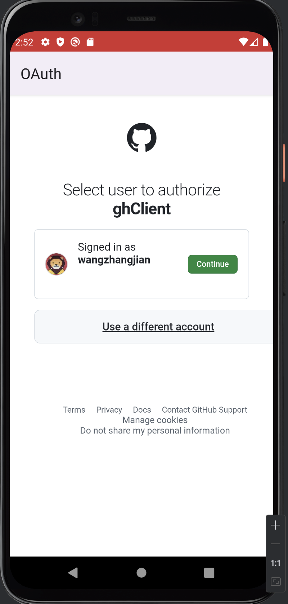

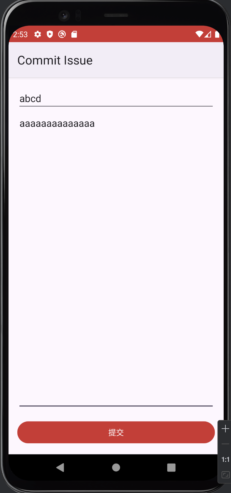

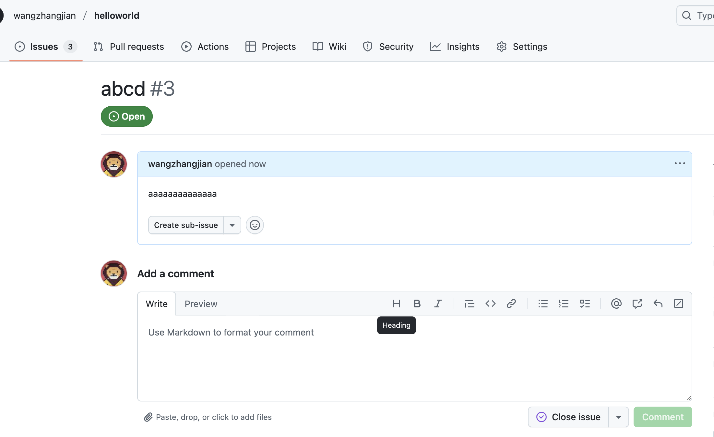
